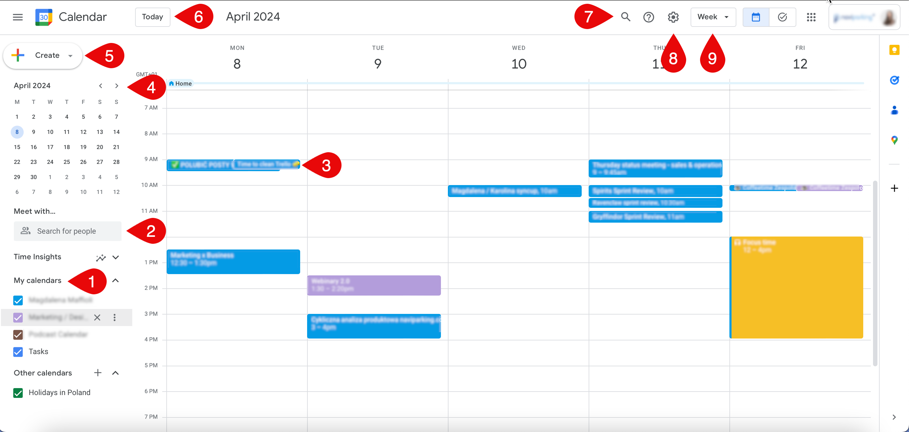

# Google Calendar: main page overview

## Introduction

The following concept topic presents an overview of the main page in Google Calendar. It highlights the key features and functionalities of Google Calendar for users (in this case it’s an employee) to see and manage their events.

## Google Calendar: main page overview. Explanation

1. **Calendar Selector:** Located on the left side of the screen, the calendar selector allows users to view different calendars they have access to, such as personal calendars, shared calendars, or subscribed calendars.

2. **Meet with:** Located on the left side of the screen, above the Calendar Selector, enables to search for searching co-workers that you want to arrange a meeting with.

3. **Events:** Positioned in the middle of the screen, the calendar displays upcoming events. It provides users with a quick overview of their upcoming schedule and important appointments.

4. **Mini Calendar:** On the left side of the screen, below the calendar selector, there is a mini calendar displaying the current month. Users can navigate to different dates by clicking on the dates in the mini calendar.

5. **Create Button:** Positioned prominently on the screen, the “Create” button allows users to create new events, reminders, or goals with a single click. It provides a streamlined way to add new entries to the calendar.

6. **Today Button:** Next to the navigation buttons, there is a "Today" button that instantly brings the user back to the current date, providing quick navigation within the calendar.

7. **Search Bar:** Located at the top of the screen, the search bar enables users to search for specific events, dates, or keywords within their calendar. It helps users quickly locate relevant information within their schedule.

8. **Settings:** Accessible through the settings icon or menu, users can customize various settings and options for their Google Calendar, including notifications, event colors, working hours, and more.

9. **Navigation Buttons:** At the top of the screen, there are navigation buttons to switch between different views, including day, week, month, and agenda views. Users can easily toggle between different timeframes to view their events.
